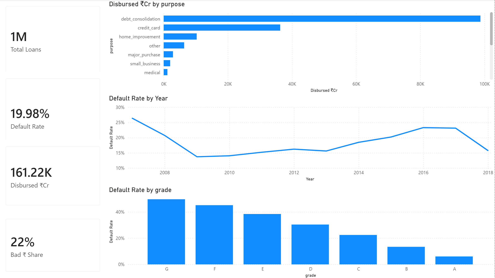
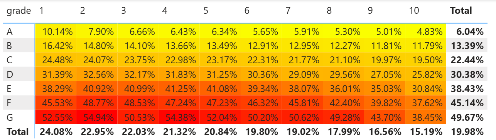
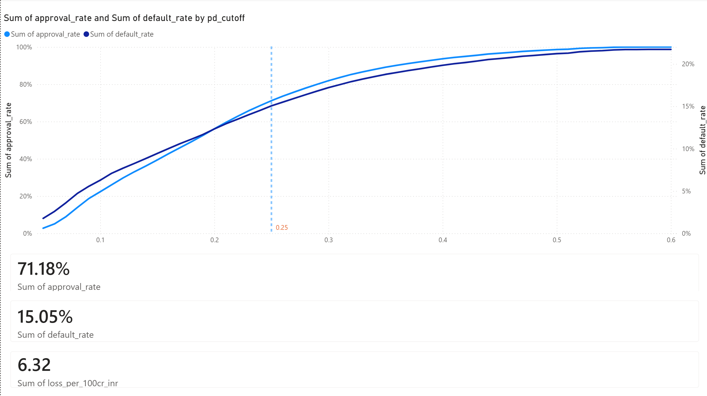
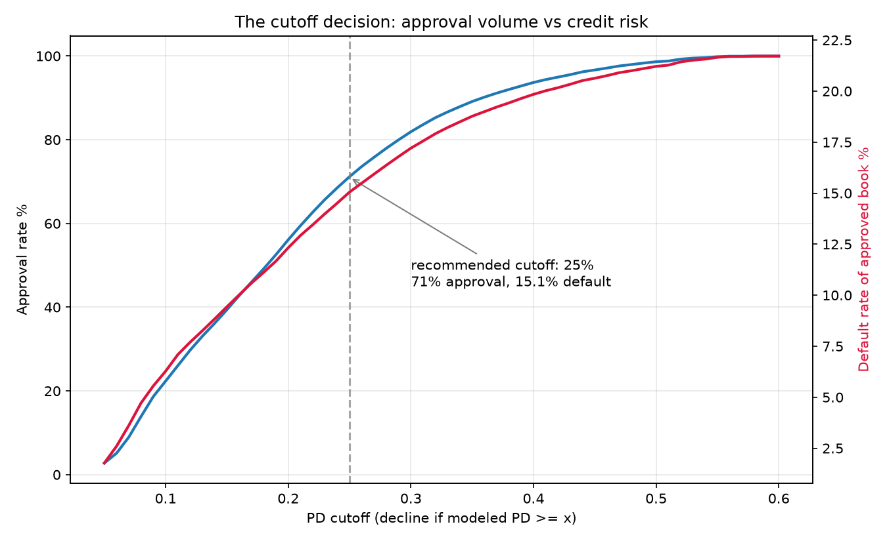
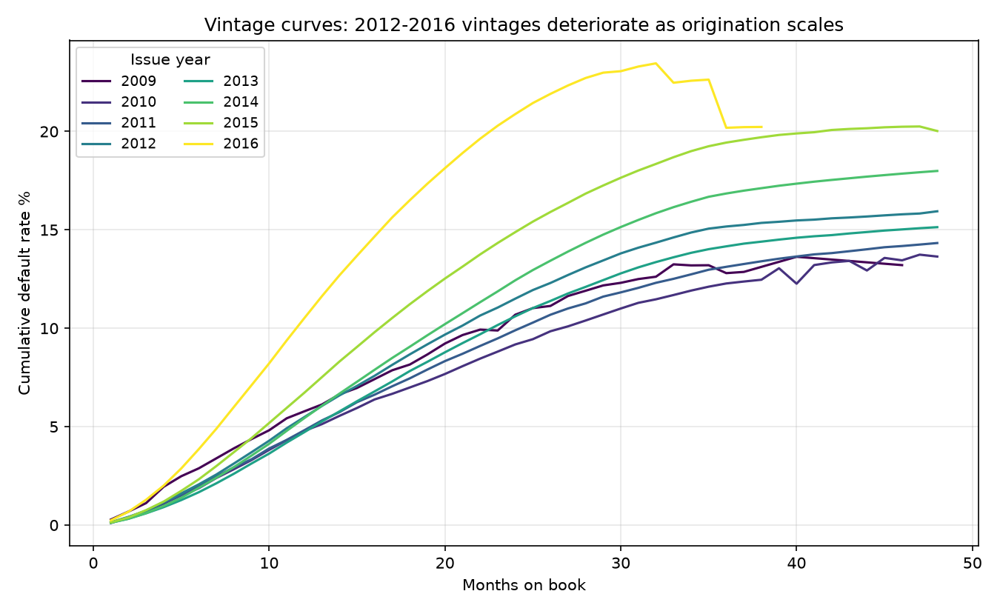
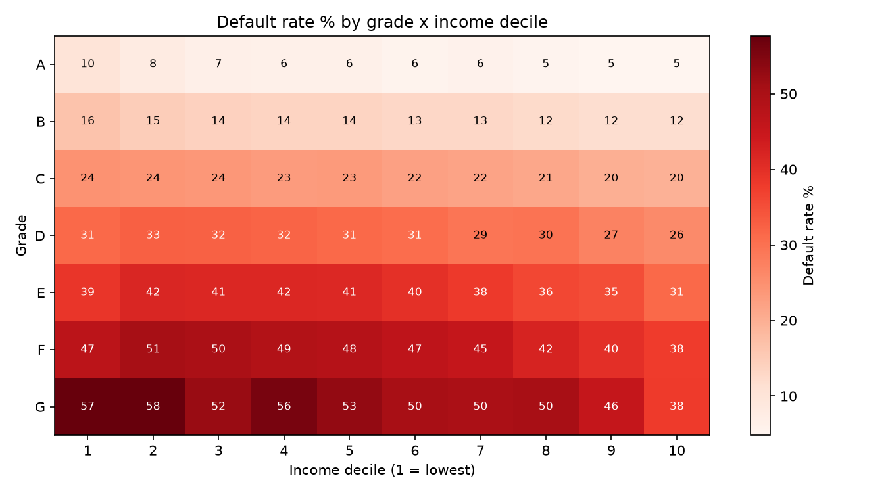
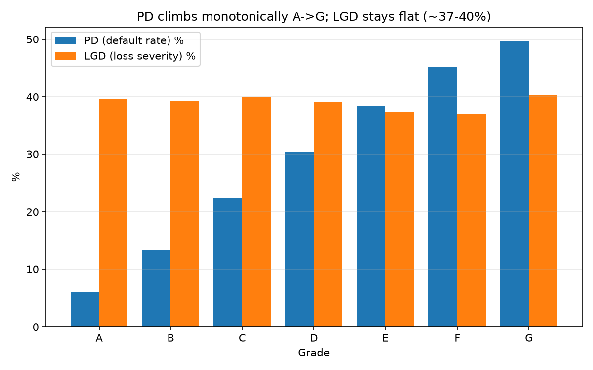

# Credit Risk & Loan Default Analytics Platform

End-to-end credit risk pipeline on 2M+ Lending Club loans: **SQL** (staging, window-function feature engineering, vintage analysis) → **Python** (EDA, logistic regression + gradient boosting, explainability) → **Power BI** (executive risk dashboard) → a **risk-committee memo** documenting the approval-cutoff decision in business terms (expected credit loss in ₹, approval-rate vs default-rate tradeoff).

> The point of this project is not "a model with high AUC." It is the full decision chain a bank risk team actually runs: define default correctly, avoid leakage, segment the book, price the risk, and defend a cutoff in front of a committee.

---

## 📊 Power BI Dashboard

A 4-page executive risk report built on the pipeline's Parquet exports. The `.pbix` lives in [`powerbi/credit_risk_dashboard.pbix`](powerbi/credit_risk_dashboard.pbix) — open it in Power BI Desktop to interact.

**Portfolio Overview** — KPI cards + default rate by grade, vintage year, and disbursed by purpose:



**Segment Risk Heatmap** — default rate by grade × income decile; the red corner (grade F–G, low income) is the 2.9× pocket:



**Cutoff Simulator** — approval-vs-default tradeoff curve with the recommended PD ≥ 25% cutoff and its business metrics:



---

## Architecture

```
Kaggle (Lending Club accepted loans, 2007–2018, ~2.26M rows)
        │  scripts/download_data.ps1
        ▼
data/raw/accepted_2007_to_2018Q4.csv.gz
        │
        ▼
DuckDB  (warehouse.duckdb) ── SQL pipeline, Postgres-compatible dialect
        │   sql/01_staging.sql        cleaning, typing, target definition, leakage drop
        │   sql/02_features.sql       window functions: NTILE deciles, cohort ranks, segment stats
        │   sql/03_risk_metrics.sql   default rate by segment, vintage curves, expected loss
        │   sql/04_export_powerbi.sql star-schema exports → data/processed/*.parquet + csv
        ▼
Python  (src/)
        │   train_model.py            logistic (baseline) + gradient boosting, calibration
        │   business_metrics.py       ECL saved, approval vs default tradeoff curve, cutoff table
        ▼
Power BI (powerbi/) — risk dashboard: portfolio KPIs, segment heatmap, vintage curves, cutoff simulator
        +
docs/risk_memo.md — the 1-page committee memo (the deliverable recruiters actually read)
```

**Why DuckDB?** Zero-install analytical SQL engine; every query here is written in Postgres-compatible dialect (window functions, CTEs, `NTILE`, `FILTER`). Swapping to PostgreSQL is a connection-string change, not a rewrite.

## The showpiece SQL

The queries that matter live in [sql/02_features.sql](sql/02_features.sql) and [sql/03_risk_metrics.sql](sql/03_risk_metrics.sql):

- **Vintage curves** — cumulative charge-off rate by months-on-book per issue-quarter cohort, built with window functions over a derived default-timing table.
- **Segment risk table** — default rate, average FICO, loss rate by `grade × purpose × income-decile`, with `NTILE(10) OVER (ORDER BY annual_inc)` deciles.
- **Peer-relative features** — each loan's DTI and rate ranked *within its grade cohort* (`PERCENT_RANK() OVER (PARTITION BY grade ...)`).

## Modeling: the decision ladder (rules + model hybrid)

Real credit decisioning is not "score everything with one model":

1. **Hard rules first** (policy layer): DTI > 60, income unverifiable, FICO < floor → auto-decline. Cheap, explainable, regulator-friendly.
2. **Model second** (grey zone): calibrated PD from gradient boosting on everything the rules pass.
3. **Cutoff by economics, not accuracy**: the threshold is chosen from the approval-rate vs expected-loss curve in `business_metrics.py`, and the choice is defended in [docs/risk_memo.md](docs/risk_memo.md).

**Leakage discipline:** all post-origination columns (`total_pymnt`, `recoveries`, `last_pymnt_d`, `out_prncp`, ...) are dropped in staging — they encode the outcome. Target = `Fully Paid` vs `Charged Off` on **completed loans only** (open loans are right-censored; including them as "good" understates PD).

## How to run

```powershell
# 1. One-time: put your Kaggle API token at %USERPROFILE%\.kaggle\kaggle.json
#    (kaggle.com → Settings → API → Create New Token)
.\scripts\download_data.ps1

# 2. Build the warehouse (staging → features → risk metrics → Power BI exports)
.venv\Scripts\python src\run_pipeline.py

# 3. Train models + generate the cutoff economics
.venv\Scripts\python src\train_model.py
.venv\Scripts\python src\business_metrics.py

# 4. Open Power BI Desktop → Get Data → Parquet → data/processed/
```

## Repo map

| Path | What it is |
|---|---|
| `sql/` | The SQL pipeline, numbered in execution order |
| `src/` | Python: pipeline runner, model training, business economics, chart generation |
| `notebooks/01_eda.ipynb` | Executed EDA with commentary — renders directly on GitHub |
| `docs/data_dictionary.md` | Field definitions + the leakage blacklist |
| `docs/risk_memo.md` | Risk-committee memo (cutoff decision, ₹ impact) |
| `powerbi/README.md` | Dashboard spec + DAX measures |
| `data/` | raw/ and processed/ — gitignored, never committed |

## Headline results (2007–2018 book, 1.35M completed loans, 19.98% default rate)

> **Segment finding:** grade F–G × debt-consolidation × low-income-decile borrowers default at 50–58% — up to **2.89× the book average**.
>
> **Cutoff decision:** declining PD ≥ 25% (gradient boosting, out-of-time AUC 0.713 / Gini 0.426) preserves a **71% approval rate** while cutting the approved book's default rate from **21.7% → 15.1%**, saving **₹3.1 Cr of credit loss per ₹100 Cr disbursed**.
>
> **Vintage story:** post-crisis vintages (2009–11) defaulted at 12–13% by month 36; quality deteriorated monotonically to 20.2% for 2016 vintages as origination scaled.
>
> **Counterintuitive:** income-*verified* loans default at 23.9% vs 14.7% for unverified — verification was triggered by riskiness (selection effect), a caution against reading operational flags as causal.

Full decision rationale: [docs/risk_memo.md](docs/risk_memo.md) · Full EDA with commentary: [notebooks/01_eda.ipynb](notebooks/01_eda.ipynb)

### The cutoff decision


### Vintage deterioration, 2009–2016


### Where risk concentrates


### PD drives loss; LGD is flat

